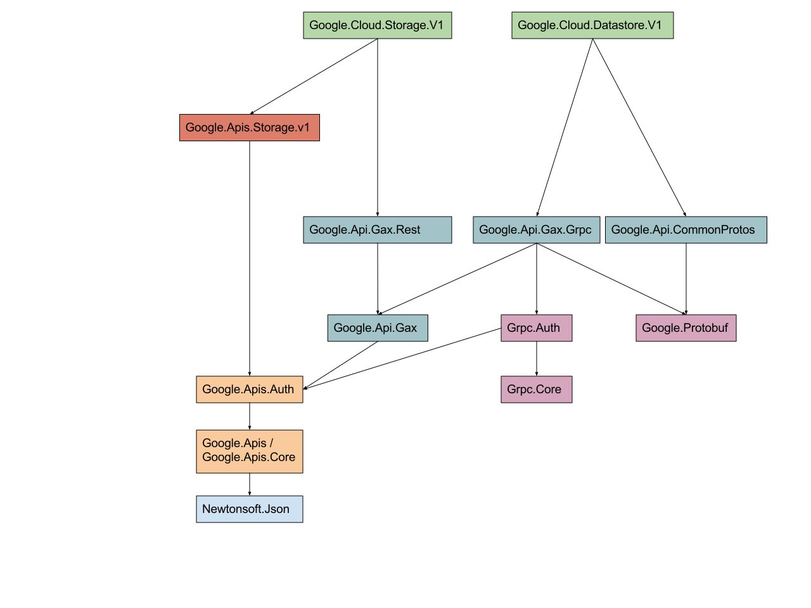

# GAX and dependencies

The Google Cloud Libraries for .NET depend on [GAX ("Google API
Extensions")](https://github.com/googleapis/gax-dotnet)
libraries for common operations and settings. This
document describes how the dependencies are changing, and the impact
on the Google Cloud Libraries.

## Background

Each Google Cloud Library for .NET depends on either
`Google.Api.Gax.Rest` or `Google.Api.Gax.Grpc` based on whether
it exposes a REST-only API or a gRPC-enabled API. Each of these
libraries in turn depends on `Google.Api.Gax`. The overall
dependency tree looks something like this:

In GAX v1, `Google.Api.Gax` depended on the authentication libraries
from the ["Google APIs client library for
.NET"](https://github.com/google/google-api-dotnet-client). The
result is that installing a single API library involves accepting
dependencies for:

- The library itself (e.g. Google.Cloud.Datastore.V1)
- Google.Api.Gax.Grpc or Google.Api.Gax.Rest
- Google.Api.Gax
- Google.Apis.Auth
- Google.Apis
- Google.Apis.Core
- Newtonsoft.Json

That's a lot of dependencies, including one we don't control
(Json.NET). Every dependency is a source of possible pain in terms
of version incompatibilities. A particular issue is the "diamond
dependency" problem: if your application (A) depends on libraries B
and C, and B and C both depend on library D, *but depend on different,
incompatible versions*, this can become intractable.

In GAX v1, a single class (`ScopedCredentialProvider`) really tied
Google.Api.Gax to `Google.Apis.Auth`. In hindsight, this class should
have been in `Google.Api.Gax.Rest` - we didn't think it was a problem,
because we hadn't considered all the possibilities for how to remove
the dependency for gRPC-based APIs, given that `Grpc.Auth` depends on
`Google.Apis.Auth`.

We have come up with an alternative plan (see below), but in order
to make that work, we need to move `ScopedCredentialProvider` to the
right place, which is a breaking change. For that reason, the GAX
libraries will get a major version bump, and all the non-prerelease
libraries that depend on them will too.

## Expected final state

In order to remove the dependency between gRPC and
`Google.Apis.Auth`, we will create two new libraries:

- `Google.Cloud.Auth`: this serves the same purpose as `Google.Apis.Auth`, but with no other
dependencies.
- `Grpc.Auth.Google`: like `Grpc.Auth`, this is just a translation
layer, this time between `Grpc.Core` and `Google.Cloud.Auth`.

Both of these names are very much subject to change - it's just
easier to document in some concrete terms.

With those libraries in place, `Google.Api.Gax.Grpc` can depend on
`Grpc.Auth.Google` instead of `Grpc.Auth`, at which point all the
legacy dependencies drop away, and gRPC-based libraries will have a
much smaller and more understandable set of dependencies.

The final dependencies will therefore look like this:

## Plan to get there

Getting to the final state without breaking customers is not
trivial. In particular, the new auth libraries have not been written
yet, and we don't want to rush them. However, we know we need to
make the breaking change to GAX, so we want to do that as soon as
possible. The start of the plan is (all dates in 2017):

- (Done) Early May: commit the changes to GAX that move
`ScopedCredentialProvider`, and add dependencies directly from both
`Google.Api.Gax.Rest` and `Google.Api.Gax.Grpc` to
`Google.Apis.Auth`, bumping the version number to 2.0. Nothing is
released to NuGet.
- Mid May: Release GAX v2.0.0-beta01 libraries, and immediately release
new pre-release versions of *all* Google Cloud Libraries to refer to
them. The previously-released GA libraries (Logging, Datastore, Storage)
need to go to 2.0.0-beta01.
- Late May: If all looks well with the pre-releases, release GAX v2
libraries and immediately release new versions of all Google Cloud Libraries
to refer to them. This time the previously-GA libraries will be new GA
versions; everything else will still be pre-release.

At that point, we have breathing room: everything refers to GAX v2,
and `Google.Api.Gax` doesn't depend on `Google.Apis.Auth` or expose
anything from that package. In particular, we can release GA
versions of Google Cloud Libraries which are ready from this point
onwards, without needing to worry about a future major version bump
in the near future.

Note that the breaking change in GAX (moving
`ScopedCredentialProvider` to a different package) is *not* expected
to break any user code, as `ScopedCredentialProvider` is really
aimed at the Google Cloud Libraries code. It's definitely a breaking
change for the Google Cloud Libraries (you wouldn't be able to use a
REST-based library compiled against GAX v1 with GAX v2). Any users
who *do* explicitly use `ScopedCredentialProvider` will simply need
to make sure they take a dependency on `Google.Api.Gax.Rest`, and
import it from its new location.

In the second half of 2017, we hope to work on the new auth
libraries. When those are complete, we can create a new *minor*
release of GAX which drops the dependency on the old auth libraries and
takes a dependency on the new auth libraries instead.

Taking a new dependency would normally require a major version bump
in SemVer. The scenario in which this causes breakage is very
unlikely in our case however, particularly because this will be a
new package and we certainly don't expect to have multiple major
versions of it in the near future. Practically speaking, the best
experience for our users will be to make this a minor version bump
instead.

## Conclusion

Any breaking changes are annoying, but we've decided that it's far
better to take the pain now while we only have a small number of GA
libraries, leaving a cleaner set of dependencies for the future. It
would be much more painful to do this in a year or two, and equally
it would be painful to continue with our legacy set of dependencies.

This document hopefully clears up any concerns or questions around
why the versions are changing, but if you have any further
questions, please [file an
issue](https://github.com/GoogleCloudPlatform/google-cloud-dotnet/issues/new).
